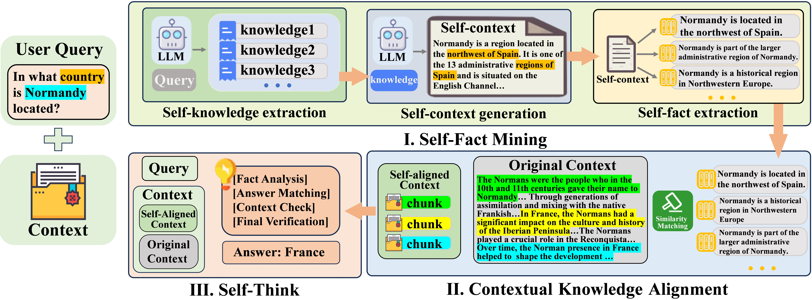

# 🌟 **Faithful-RAG**  
> *FaithfulRAG: Fact-Level Conflict Modeling for Context-Faithful Retrieval-Augmented Generation (ACL 2025)*  
> A novel RAG framework explicitly modeling fact-level conflicts for more faithful retrieval-augmented generation.

<p align="center">
  <a href="https://arxiv.org/abs/2506.08938" target="_blank">
    
  </a>
  <a href="https://huggingface.co/datasets/eric-xiang/FaithfulRAG-Dataset" target="_blank">
    
  </a>
  <a href="https://github.com/XMUDeepLIT/Faithful-RAG" target="_blank">
    
  </a>
</p>

---

## 🚀 **Highlights**
- ✅ **Fact-Level Faithfulness**: Explicit modeling of conflicts between retrieved context and LLM generations.
- 🧑‍🔬 **Strong Results**: Outperforms previous RAG methods on context-faithfulness benchmarks.
- 💡 **Easy Integration**: Support for OpenAI / HuggingFace / LlamaFactory backends.
- 📊 **Evaluation Tools**: Built-in faithful evaluation pipeline with CoT support.

<p align="center">
  
</p>

---

## 🛠️ **Usage**
### 1️⃣ Install Dependencies  
```bash
pip install -r requirements.txt
```
### 2️⃣ Quick Start Example

```python
import asyncio
from datasets import load_dataset
from faithfulrag import FaithfulRAG

# Load dataset
ds = load_dataset("eric-xiang/FaithfulRAG-Dataset",split="faitheval_data")


# Initialize FaithfulRAG pipeline
rag = FaithfulRAG(
    backend_type="openai",  # or "hf", "llamafactory"
    model_name="gpt-3.5-turbo",
    similarity_model="all-MiniLM-L6-v2"
)

async def run_pipeline():
    # Generate self-consistent facts
    self_facts = await rag.get_self_facts(dataset)

    # Retrieve top contextual chunks
    topk_chunks = rag.get_topk_chunks(dataset, self_facts)

    # Generate predictions
    predictions = await rag.get_predictions(
        dataset, 
        topk_chunks,
        generation_type="normal_cot"  # or "scheduled_cot", "wo_cot"
    )

    # Evaluate results
    results = rag.evaluate(dataset, predictions, cot_format=True)
    print(f"Exact Match: {results['exact_match']:.2f}%")

asyncio.run(run_pipeline())
```

## 📖 Citation

If you find this work helpful, please consider citing us:
```bibtex
@misc{zhang2025faithfulragfactlevelconflictmodeling,
      title={FaithfulRAG: Fact-Level Conflict Modeling for Context-Faithful Retrieval-Augmented Generation}, 
      author={Qinggang Zhang and Zhishang Xiang and Yilin Xiao and Le Wang and Junhui Li and Xinrun Wang and Jinsong Su},
      year={2025},
      eprint={2506.08938},
      archivePrefix={arXiv},
      primaryClass={cs.CL},
      url={https://arxiv.org/abs/2506.08938}, 
}
```
## 📬 Contact
✉️ Email: xzs.xiang@hotmail.com
